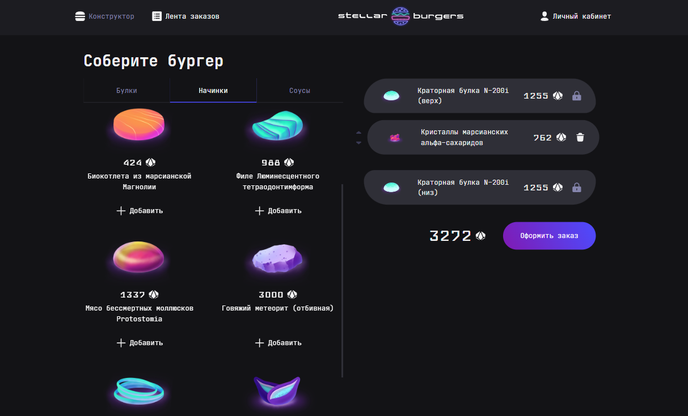
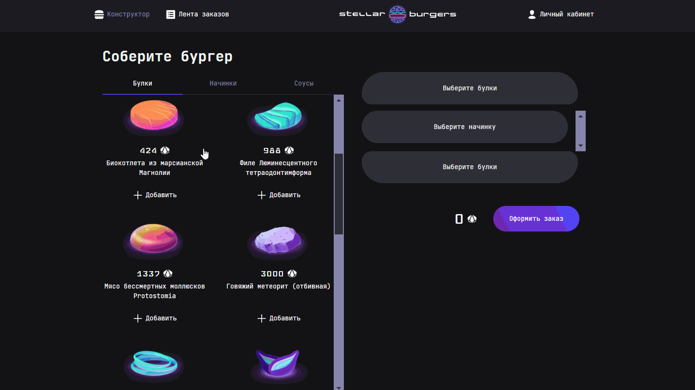

# Stellar Burgers
 **Stellar Burgers**  - это удобное приложение, которое позволяет пользователям создавать свои собственные бургеры, оформить заказ онлайн.  Приложение предлагает широкий выбор уникальных межгалактических ингредиентов, соусов, начинок и булочек, а также функцию виртуального конструктора бургеров, где можно визуально собрать бургер, оценить стоимость изделия. <br>

 **Основные функции:** 
- Конструктор бургеров: соберите свой идеальный бургер, выбирая из разнообразия свежих ингредиентов. 
- Заказ онлайн: оформите заказ в несколько касаний. 
- Личный профиль: отслеживайте историю заказов.
---
## Обзор проекта

<details><summary>DEMO Stellar Burgers</summary>

  
</details>

 Ссылка на макет [Figma](https://www.figma.com/design/vIywAvqfkOIRWGOkfOnReY/React-Fullstack_-%D0%9F%D1%80%D0%BE%D0%B5%D0%BA%D1%82%D0%BD%D1%8B%D0%B5-%D0%B7%D0%B0%D0%B4%D0%B0%D1%87%D0%B8-(3-%D0%BC%D0%B5%D1%81%D1%8F%D1%86%D0%B0)_external_link?node-id=849-1002&t=VhfFtQQA97xYOoQa-0).

---
## Было сделано:
1. Настроен роутинг.
2. Написан функционал запросов данных с сервера, используя `Redux` и глобальный `store`.
3. Настроена авторизация и созданы защищённые роуты.
4. Написаны unit тесты на Jest ([см. тест](/__tests__/)):
    - Тест проверяющий корректную настройку и работу корневого редьюсера.
    - Тесты проверяющие редьюсер слайса burgerConstructorSlice (конструктора бургера).
    - Тесты проверяющие редьюсеры остальных слайсов: при вызове экшена Request, Success, Failed.
5. Написаны интеграционные тесты на Cypress ([см. тест](/cypress/e2e/stellarBurger/stellarBurger.cy.ts)).
---
## Стек
HTML, CSS, React, React-Router, TypeScript, React-Redux, Webpack

---
## Установка и запуск
### `Требования`
Для установки и запуска проекта, необходим NodeJS v8+.
### `Установка зависимостей`
Для установки зависимостей, выполните команду:
```
$ npm i
```
### `Запуск Development сервера`
Чтобы запустить сервер для разработки, выполните команду:
```
npm start
```
Приложение будет доступно по локальному адресу http://localhost:4000/.

---
## Тестирование
Для запуска тестирования на Jest, выполните команду:
```
npm test
```
Для запуска тестирования на Cypress, выполните команду:
```
npm run cypress:open
```
---
## Статус проекта
На данный момент планируется следующее:
-	доработать логику отработки ошибок
